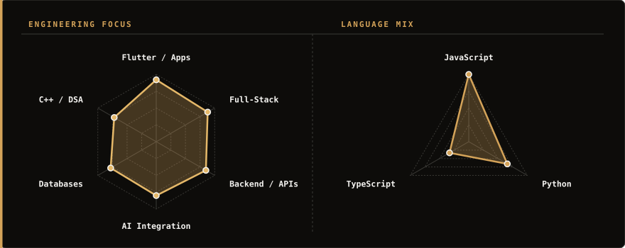
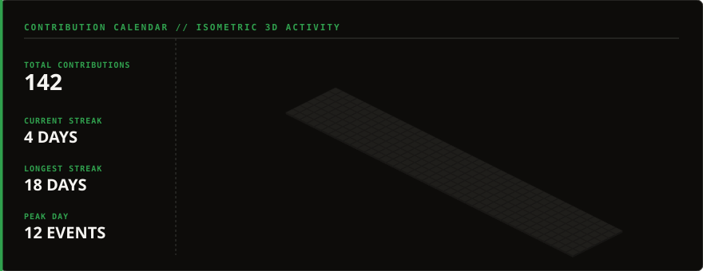
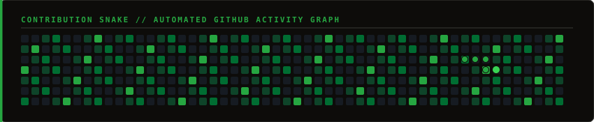
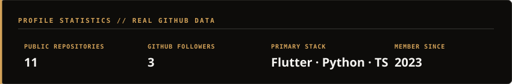

  <picture>
    <source media="(prefers-color-scheme: dark)" srcset="assets/portrait-dark.svg">
    <source media="(prefers-color-scheme: light)" srcset="assets/portrait-light.svg">
    
  </picture>

 

<h1 align="center">HAMZA TAIF</h1>

 

  
  
  
  
  

 

> I'm a Software Engineering student at UET Peshawar building full-stack apps and AI tools — from interface to backend.

 
 

### ~/ TOOLBOX

 

  <picture>
    <source media="(prefers-color-scheme: dark)" srcset="assets/toolbox-dark.svg">
    <source media="(prefers-color-scheme: light)" srcset="assets/toolbox-light.svg">
    
  </picture>

 
 

### 01 / SKILL &amp; LANGUAGE RADARS

 

  <picture>
    <source media="(prefers-color-scheme: dark)" srcset="assets/radars-dark.svg">
    <source media="(prefers-color-scheme: light)" srcset="assets/radars-light.svg">
    
  </picture>

 
 

### 02 / 3D CONTRIBUTION CALENDAR

 

  <picture>
    <source media="(prefers-color-scheme: dark)" srcset="assets/github-metrics-dark.svg">
    <source media="(prefers-color-scheme: light)" srcset="assets/github-metrics-light.svg">
    
  </picture>

 
 

### 03 / CONTRIBUTION SNAKE

 

  <picture>
    <source media="(prefers-color-scheme: dark)" srcset="assets/snake-dark.svg">
    <source media="(prefers-color-scheme: light)" srcset="assets/snake-light.svg">
    
  </picture>

 
 

### 04 / GITHUB STATS

 

  <picture>
    <source media="(prefers-color-scheme: dark)" srcset="assets/stats-dark.svg">
    <source media="(prefers-color-scheme: light)" srcset="assets/stats-light.svg">
    
  </picture>

 
 

### 05 / SELECTED WORK

 

  <picture>
    <source media="(prefers-color-scheme: dark)" srcset="assets/project-uet-connect-dark.svg">
    <source media="(prefers-color-scheme: light)" srcset="assets/project-uet-connect-light.svg">
    
  </picture>

 

  <picture>
    <source media="(prefers-color-scheme: dark)" srcset="assets/project-apex-discipline-dark.svg">
    <source media="(prefers-color-scheme: light)" srcset="assets/project-apex-discipline-light.svg">
    
  </picture>

 

  <picture>
    <source media="(prefers-color-scheme: dark)" srcset="assets/project-cloudguardian-dark.svg">
    <source media="(prefers-color-scheme: light)" srcset="assets/project-cloudguardian-light.svg">
    
  </picture>

 
 

### 06 / JOURNEY

 

  <picture>
    <source media="(prefers-color-scheme: dark)" srcset="assets/journey-dark.svg">
    <source media="(prefers-color-scheme: light)" srcset="assets/journey-light.svg">
    
  </picture>

 
 

### 07 / CONNECT

* [hamzataif.me](https://hamzataif.me) &nbsp;—&nbsp; Portfolio ↗
* [github.com/HamzaTaif](https://github.com/HamzaTaif) &nbsp;—&nbsp; GitHub ↗
* [@Hamza\_Taif\_Khan](https://x.com/Hamza_Taif_Khan) &nbsp;—&nbsp; X / Twitter ↗

 
 

  <picture>
    <source media="(prefers-color-scheme: dark)" srcset="assets/signature-dark.svg">
    <source media="(prefers-color-scheme: light)" srcset="assets/signature-light.svg">
    
  </picture>

