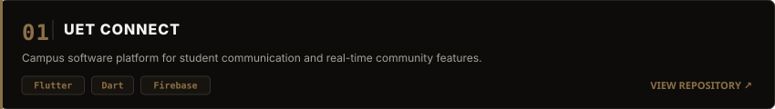
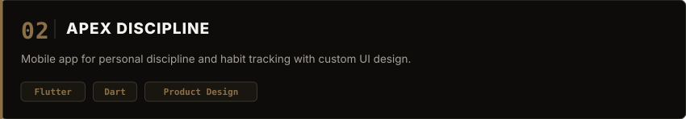
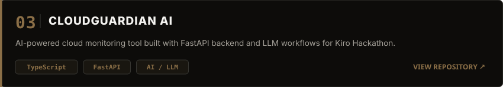
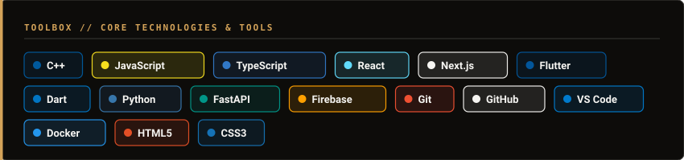
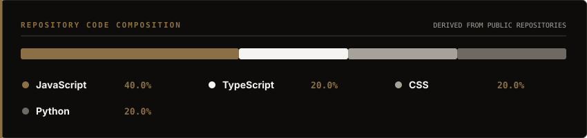
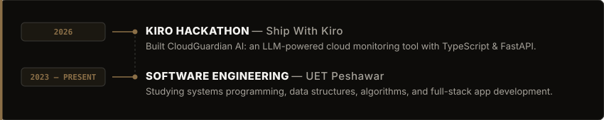
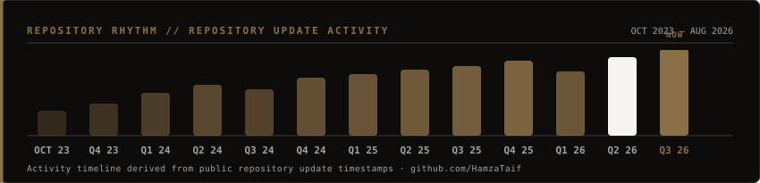

  <picture>
    <source media="(prefers-color-scheme: dark)" srcset="assets/hero-dark.svg">
    <source media="(prefers-color-scheme: light)" srcset="assets/hero-light.svg">
    
  </picture>

 

I'm a Software Engineering student at UET Peshawar building full-stack apps and AI tools — from interface to backend.

 

### 01 / NOW

**Cross-platform apps**  
Building cross-platform apps for campus and everyday use.

**AI &amp; backend**  
Experimenting with FastAPI services and LLM API integrations, mostly in Python.

**Product development**  
Taking projects from interface to backend and deployment.

 
 

### 02 / SELECTED WORK

 

  <picture>
    <source media="(prefers-color-scheme: dark)" srcset="assets/project-uet-connect-dark.svg">
    <source media="(prefers-color-scheme: light)" srcset="assets/project-uet-connect-light.svg">
    
  </picture>

 

  <picture>
    <source media="(prefers-color-scheme: dark)" srcset="assets/project-apex-discipline-dark.svg">
    <source media="(prefers-color-scheme: light)" srcset="assets/project-apex-discipline-light.svg">
    
  </picture>

 

  <picture>
    <source media="(prefers-color-scheme: dark)" srcset="assets/project-cloudguardian-dark.svg">
    <source media="(prefers-color-scheme: light)" srcset="assets/project-cloudguardian-light.svg">
    
  </picture>

 
 

### 03 / TOOLBOX

 

  <picture>
    <source media="(prefers-color-scheme: dark)" srcset="assets/toolbox-dark.svg">
    <source media="(prefers-color-scheme: light)" srcset="assets/toolbox-light.svg">
    
  </picture>

 
 

### 04 / CODE COMPOSITION

 

  <picture>
    <source media="(prefers-color-scheme: dark)" srcset="assets/languages-dark.svg">
    <source media="(prefers-color-scheme: light)" srcset="assets/languages-light.svg">
    
  </picture>

 
 

### 05 / JOURNEY

 

  <picture>
    <source media="(prefers-color-scheme: dark)" srcset="assets/journey-dark.svg">
    <source media="(prefers-color-scheme: light)" srcset="assets/journey-light.svg">
    
  </picture>

 
 

### 06 / REPOSITORY RHYTHM

 

  <picture>
    <source media="(prefers-color-scheme: dark)" srcset="assets/pulse-dark.svg">
    <source media="(prefers-color-scheme: light)" srcset="assets/pulse-light.svg">
    
  </picture>

 
 

### 07 / CONNECT

* [hamzataif.me](https://hamzataif.me) &nbsp;—&nbsp; Portfolio ↗
* [github.com/HamzaTaif](https://github.com/HamzaTaif) &nbsp;—&nbsp; GitHub ↗
* [@Hamza\_Taif\_Khan](https://x.com/Hamza_Taif_Khan) &nbsp;—&nbsp; X / Twitter ↗

 
 

  <picture>
    <source media="(prefers-color-scheme: dark)" srcset="assets/signature-dark.svg">
    <source media="(prefers-color-scheme: light)" srcset="assets/signature-light.svg">
    
  </picture>

